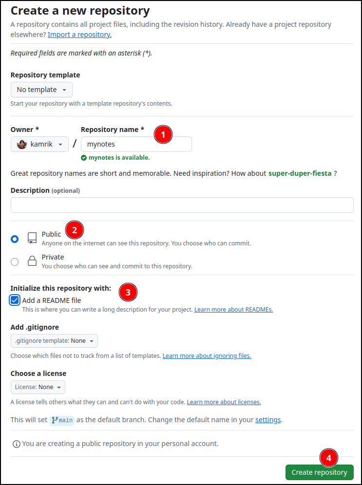
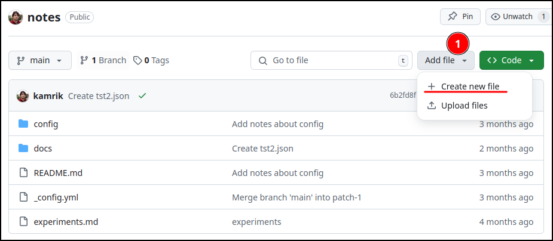

# DRAFT - do NOT start

# Lab week 4 - GitHub Pages
## Material covered during the lecture:
- Keyboards, touch-typing and keyboard shortcuts  
- Text editors - notepad, vi, [VSCode](https://code.visualstudio.com/download), [Notepad++](https://notepad-plus-plus.org/)
- Searching in text - wildcards and the basics of regex 


## Step 1 - Create your own public repo
In previous labs we edited files in a repository created by GitHub Classroom. In this lab you will need to work with two repositories:

1. Your own repository, where most of the editing will happen.
1. The usual GitHub Classroom repo like in the previous labs. With an address like this: `github.com/comp1238w25/lab4-username`. It will be used to tell the autograder where to look for the first repo.


To create your own repository, go to [github.com](https://github.com) and click the green `New` button. Alternatively you can go directly to [github.com/new](https://github.com/new). Then follow the steps below. Numbers refer to the red circles on the screenshot.

1. Select a name for your repo. Something simple like "notes" or "links" or "gbc" is best. The idea is to make this repo useful beyond this lab.

1. Select the "Public" option. This is important because the GitHub Pages feature is not available for private repos, unless you are using a paid account.

1. Check the "Add README" checkbox

1. Click the big green button "Create repository" at the bottom.




## Step 2 - Enable "GitHub Pages" on your repo
`GitHub Pages` creates a website from the MarkDown files in your repository. Enable GitHub Pages using the screenshot below (follow the number order).

(1) `Settings` → (2) `Pages` → (3) Branch: `main`, folder `(root)` → (4) click **`Save`**


It takes about 40 seconds for the change to take effect. You can see the progress under “Actions”. GitHub uses a process similar to the autograder to convert your MarkDown files into a website. The website will be rebuilt each time you change anything in the repo.

You can see your new page at  
`https://your_username.github.io/repo_name`  
Note the `.io` instead of `.com` in `github.io`  
For example Mark’s page is at   
https://kamrik.github.io/notes/  
because the repo is called `notes` and the username is `kamrik`

Congratulations, you have your own website! Let's add some content.

## Step 3 - Edit your website

### Step 3.1 - Explore some keyboard shortcuts
Edit the README.md file. Add a section listing some 3 keyboard shortcuts you already use frequently (if any) and 3 more shortcuts you would like to start using. Feel free to google for common keyboard shortcuts.

For example:
```
## Keyboard shortcuts
Shortcuts I frequently use: 
- Ctrl-C (copy)
- Ctrl-V (paste)
- Ctrl-Z (undo)

Shortcuts I would like to start using: 
- Ctrl-A (select all)
- Win-D (show desktop)
- Super-Hyper-Meta-F (I don’t have those keys, but I wish I did)
```

### Step 3.2 - Search
Copy the Markdown from the block below into your README and while still in the edit mode bring up the search dialog by pressing Ctrl-F

````
## Search Experiments
Try searching for the word "line"

```
Line
line
lines
line 5
line-7
line72
line73.4
end of line
end-of-line
outline
linear
```
````

- Observe how different the search dialog is in edit mode compared 
  to the usual search dialog of the browser. This is a version of a typical search-and-replace dialog you will see in most text editors.
- Try searching (Ctrl-F) for the word “line”
- Try checking each of the checkboxes in the search dialog and see how they affect the search (if at all)
  - Match Case
  - Regexp
  - By Word


Try searching using the following regex patterns. Enable regex search by checking the "Regexp" checkbox, keep the other two unchecked.

- `line\d`
- `line\d+`
- `line\d*`
- `^line`
- `line$`


### Step 3.3 - Create a second .md file

Each MarkDown (.md) file will become a page of your website. README.md you edited in the previous steps becomes the main page, but for a real "website experience" we need at least one other page.

- Create another file with a short name like `links.md` (any name is ok, but keep it a single word for this lab)

- In the new file add some links (preferably useful to you). Remember, links in Markdown look link `[text](url)`. Any links are ok, see some examples below the following screenshot.

- Edit your README file and add a link from there to the new .md file. Otherwise you won't be able to access the page corresponding to this new file on your website. A link to a file located in the same repo looks like  
`[link text](file_name.md)`  
For example, a link to the autograder instructions looks like  
`[about autograder](autograder_instructions.md)`  
and renders as
[about autograder](autograder_instructions.md)



---
 Example of compactly formatted links, check the raw MarkDown view of this file
  - **MS Office:** 
  [Outlook](https://outlook.office.com/) • 
  [Teams](https://teams.microsoft.com/v2/) •
  [OneDrive](https://georgebrowncollege-my.sharepoint.com/) •
  [Whiteboard](https://app.whiteboard.microsoft.com/)  
  - **GBC:** 
  [D2L](https://learn.georgebrown.ca) • 
  [AtKlass](https://app.atklass.com) • 
  [Important Dates](https://www.georgebrown.ca/current-students/important-dates?term=27246&category=131)
---

### Step 3.4 - change your website's visual theme
- Create a new file called  `_config.yml` (this exact name)
- Copy the following 2 lines into it

```
title: Demo notes repo
theme: jekyll-theme-architect
```

After you commit (save) this file, GitHub will rebuild the website. It takes some time, 20-40 seconds, you can see the progress under `Actions`. Check how your website looks like with the new theme.


Experiment with applying any of the following themes. You can remove the `theme` line from _config.yml to go back to the default theme.

- [jekyll-theme-architect](https://pages-themes.github.io/architect/)
- [jekyll-theme-cayman](https://pages-themes.github.io/cayman/)
- [jekyll-theme-dinky](https://pages-themes.github.io/dinky/)
- [jekyll-theme-hacker](https://pages-themes.github.io/hacker/)
- [jekyll-theme-leap-day](https://pages-themes.github.io/leap-day/)
- [jekyll-theme-merlot](https://pages-themes.github.io/merlot/)
- [jekyll-theme-midnight](https://pages-themes.github.io/midnight/)
- [jekyll-theme-minimal](https://pages-themes.github.io/minimal/)
- [jekyll-theme-modernist](https://pages-themes.github.io/modernist/)
- [jekyll-theme-slate](https://pages-themes.github.io/slate/)
- [jekyll-theme-tactile](https://pages-themes.github.io/tactile/)
- [jekyll-theme-time-machine](https://pages-themes.github.io/time-machine/)

## Step 4 - Submit your work
- Follow the assignment invitation link:  
  https://classroom.github.com/a/L8FlbEbP
- In the new Classroom repo edit the README file and append a link to your site repo at the bottom. The link should look like this:  
`https://github.com/username/repo_name`  
- Save - this will trigger the autograder. Check for output under "Actions". Make sure to read the output in the black section.
- To submit again, make any change in the README, for example


```
...
attempt number 42
https://github.com/username/repo_name
```
> - Changes to the GitHub Classroom repo at `github.com/comp1238w25/lab4-username` will trigger the autograder  
> - Change to the site repo at `github.com/username/repo_name` triggers a rebuild of the website, but NOT the autograder.


### The autograder will be looking for the following 4 points - 25% each

1. A link to your GitHub repo is provided and looks like this  
  `https://github.com/username/repo_name`  
   - With or without the https:// part is ok  
   - Make sure the user and repo names are yours
1. Repo pointed to by that link exists and contains a README.md file
1. That README.md file contains a link to another .md file, formatted as  
`[some text](file_name.md)`
1. The website `username.github.io/repo_name` is active 


