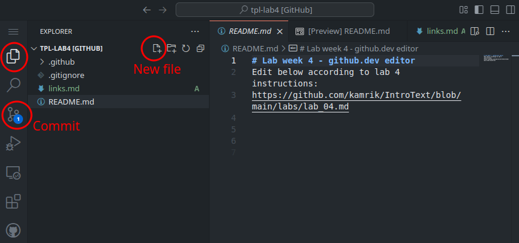
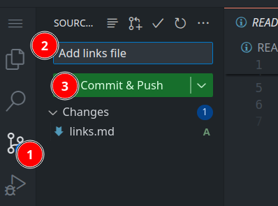

# Lab week 4 - `github.dev` editor

## Material covered during the lecture:
- Keyboards, touch-typing and keyboard shortcuts  
- Text editors - notepad, vi, [VSCode](https://code.visualstudio.com/download), [Notepad++](https://notepad-plus-plus.org/)
- Searching in text - wildcards and the basics of regex 

## Step 1 - Accept assignment invitation link
Follow the assignment invitation link  
https://classroom.github.com/a/Jge9MazW  
Once your repository is created, edit it following the instructions below.

## Step 2 - Edit the lab repo using the `github.dev` editor

Open the front page of your repo, and replace the `.com` with `.dev` in the browser address bar. Example:  
`github.com/comp1238w25/lab4-kamrik/` - .com for repo  
`github.dev/comp1238w25/lab4-kamrik/` - .dev for editor

It will open the repo in a text editor that should look similar to this screenshot:



Open the README.md file. In order to see the rendered preview (if it's not already open), press `Ctrl-Shift-V` on Mac it's `Cmd-Shift-V`

## Step 3 - Explore some keyboard shortcuts
Edit the README.md file. Add a section titled "Keyboard shortcuts" listing several keyboard shortcuts you already use frequently (if any) and 3 more shortcuts you would like to start using. Feel free to google for common keyboard shortcuts.

For example:
```markdown
## Keyboard shortcuts
Shortcuts I frequently use: 
- Ctrl-C (copy)
- Ctrl-V (paste)
- Ctrl-Z (undo)

Shortcuts I would like to start using: 
- Ctrl-A (select all)
- Win-D (show desktop)
- Super-Hyper-Meta-F (I don’t even have such keys, but it sounds impressive)
```


## Step 4 - Search
Copy the following block into your README file

````markdown
## Search Experiments
Try searching for the word "line"

```
Line
line
lines
line 5
line-7
line72TODO
line73.4
end of line
end-of-line
outline
linear
```
````

- Try searching (Ctrl-F) for the word “line”
- Try hovering with the mouse over all the icons in the Search dialog and see what they mean
- Try clicking buttons 1 and 2 in the screenshot and see how they affect the search


Try searching using the following regex patterns. Enable regex search by toggling button 3 from the screenshot above.
- `line\d`
- `line\d+`
- `line\d*`
- `^line`
- `line$`


## Step 5 - Create a new Markdown file and link to it

### Step 5.1 - Create a new Markdown file
1. In the `.dev` editor, create a new Markdown file named `links.md` (see the screenshot at the top)
2. Add the following content to `links.md`:

  ```markdown
  ## Useful Links
  This is a compact way to render some useful links

  - **MS Office:** 
  [Outlook](https://outlook.office.com/) • 
  [Teams](https://teams.microsoft.com/v2/) •
  [OneDrive](https://georgebrowncollege-my.sharepoint.com/) •
  [Whiteboard](https://app.whiteboard.microsoft.com/)  
  - **GBC:** 
  [D2L](https://learn.georgebrown.ca) • 
  [AtKlass](https://app.atklass.com) • 
  [Important Dates](https://www.georgebrown.ca/current-students/important-dates?term=27246&category=131)
   ```


### Step 5.2
Go back to the `README.md` file and add a new section near the bottom titled **More Resources**, with a link to your new `links.md` file.

   Example:

  ```markdown
  ## More Resources

  Check out the [Useful Resources](./links.md) page for useful links.
  ```

## Committing the changes
The system requires a commit message in the textbox labeled as (2) on the screenshot below. Type anything, in this case something like “Add links file” would be an appropriate commit message. After you commit, Check for autograger output under `Actions`

Modify and commit your files as many times as you need.





